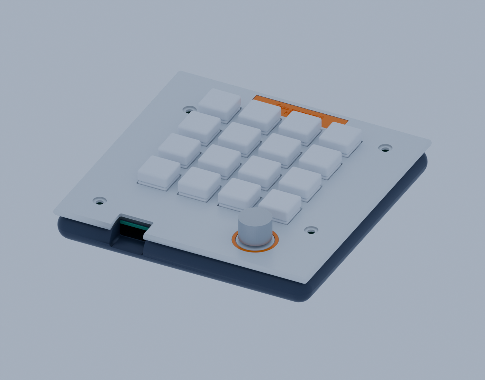

# Hackpad 16 — Blender case redesign

A redesigned, two-piece sandwich enclosure for the supplied 100 × 100 mm Hackpad 16 PCB. The case follows the Hackpad guide dimensions and keeps the existing board’s actual asymmetric mounting-hole locations.

## Guide dimensions used

- PCB cavity: 100.4 × 100.4 mm, giving 0.2 mm clearance on each side
- Outer case: 120 × 120 mm, giving a 10 mm border around the PCB
- Lower tray: 3 mm floor and 10 mm side wall
- Top switch plate: 3 mm thick
- Switches: 4 × 4 grid at 19.05 mm pitch, with 14.4 mm plate openings

The case also has an edge opening for USB-C, four PCB-matched standoffs and plate screw holes, a 7.4 mm EC11 bushing opening, a separate accent ring, and an underside hatch for access to the XIAO BOOT/RESET buttons. The badge reads “Tejas got not chill” over “Hackpad.”

The visual encoder knob is narrower than the bezel opening and stands 1.5 mm above the plate at its lower edge, leaving room for the knob to move down when pressed. The electrical click is provided by the EC11 encoder’s integrated push switch on the PCB. The real encoder and selected knob still need a physical press-fit check.

## Files

- hackpad16_case.blend — editable Blender scene. Printable case parts have numbered names; objects labelled PROXY ONLY are visual placeholders and are not printing parts.
- lower_tray.stl — lower case, including PCB standoffs and service opening
- switch_plate.stl — top plate and switch/encoder openings
- service_hatch.stl — removable access cover
- encoder_bezel.stl — optional accent ring with extra clearance around a pressable knob
- hackpad16_badge.stl — separate Tejas got not chill / Hackpad badge
- hackpad16_case_preview.png — assembled render
- build_case.py — Blender script used to generate the model and STLs

The STL files are each positioned on Z=0 for easier slicing. Print the lower tray with its floor on the bed and the plate flat. A sensible first pass is 0.2 mm layers, 3–4 walls, and 20–30% infill.

## Assembly and fit

The board pattern is intentionally asymmetric, so use this exact PCB. Use four M3 screws through the plate and PCB into the tray’s 2.7 mm pilot holes; confirm screw length against your print and board stack. The service hatch uses four M2 self-tapping screws.

This is a CAD redesign and has not been physically test-fitted. Before printing everything, test one switch opening and check the exact switches, encoder nut/bushing, USB-C plug, board standoff alignment, and XIAO service-hatch access against your hardware and printer. Dimensions may need adjustment for printer shrinkage and component tolerances.
